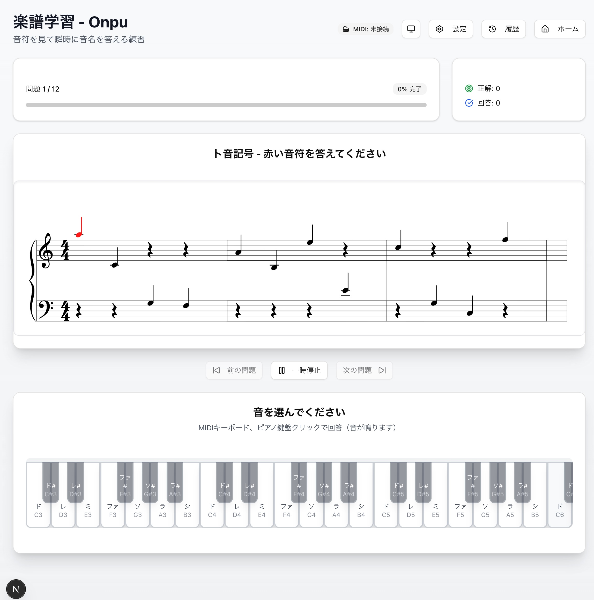

# 🎵 Onpu - 楽譜学習アプリ

音符を見て瞬時に音名を答える練習ができる楽譜学習アプリケーションです。


## 📱 アプリケーション画面



*双譜表表示（ト音記号・ヘ音記号）とマルチオクターブピアノ鍵盤を備えた練習画面*

## 📖 概要

**Onpu**は、楽譜を読む力を向上させるためのWebアプリケーションです。音符を見てド（C）から数えることなく、瞬時に音名を答えられるようになることを目標としています。

### 🎯 対象ユーザー
- 楽譜の読み取りを上達したい音楽学習者
- 音楽教師・指導者
- MIDI キーボードを活用して学習したい方

## ⚡ クイックスタート

### インストールと起動

```bash
# 1. リポジトリをクローン
git clone https://github.com/your-username/onpu.git
cd onpu

# 2. アプリディレクトリに移動
cd onpu-next

# 3. 依存関係をインストール
npm install

# 4. 開発サーバーを起動
npm run dev
```

**アプリケーションは http://localhost:3000 で利用できます**

### 🛑 停止方法

```bash
# 開発サーバーの停止
Ctrl + C  # ターミナルで実行中の場合
```

### 🏗️ 本番環境用ビルド

```bash
# ビルド実行
npm run build

# 本番サーバー起動
npm start
```

## 主な機能

### ✅ 実装済み機能

- **楽譜表示**: Vexflowライブラリを使用した美しく正確な楽譜表示
- **複数音符練習**: 横に12個の音符が並び、対象音符が赤色で表示
- **音部記号対応**: ト音記号・ヘ音記号の両方に対応
- **MIDI入力**: MIDIキーボードでの回答入力に対応
- **複数入力方式**: 
  - MIDIキーボード
  - PCキーボード（C〜Bキー）
  - マウスクリック
- **音声フィードバック**: 回答時に音が鳴る機能
- **設定管理**: 練習内容・入力方法・表示設定の詳細カスタマイズ
- **学習履歴**: 練習セッションの記録と統計表示
- **ダークモード**: 楽譜エリアは白背景を維持した適切なダークモード
- **レスポンシブデザイン**: モバイル・タブレット対応
- **データポータビリティ**: JSON形式での設定・履歴のエクスポート/インポート

### 🎯 練習機能
- **問題数**: 10-100問の範囲で設定可能
- **音域プリセット**: 
  - 初心者 (C4-C5): 2オクターブの基本練習
  - 中級 (C3-C6): 4オクターブの応用練習
  - カスタム: 任意の音域設定
- **難易度レベル**: 簡単・普通・難しい
- **自動進行機能**: 正解後の自動進行（遅延時間調整可能）
- **オクターブ判定**: 正確なオクターブでの回答が必要（D4とD3は別の回答として判定）
- **双譜表表示**: ト音記号とヘ音記号を同時に表示

### 🎹 MIDI機能
- **対応デバイス**: Launchkey MK4などの各種MIDIキーボードに対応
- **接続状態永続化**: ページ間での接続状態維持
- **オクターブ認識**: 正確なオクターブを含む判定
- **リアルタイム入力**: 遅延のない入力処理

### 🎼 楽譜表示機能
- **Vexflow統合**: プロ品質の楽譜レンダリング
- **双譜表レイアウト**: ト音記号・ヘ音記号を同時表示
- **音符ハイライト**: 対象音符を赤色で明示
- **レスポンシブ**: 画面サイズに応じた楽譜サイズ調整

### 🎨 ピアノ鍵盤機能
- **複数オクターブ対応**: 設定音域に応じて1-4オクターブ表示
- **シャープ・フラット**: 黒鍵盤の有効/無効切り替え
- **オクターブ表示**: 各鍵盤にオクターブ番号を表示（C3、D4等）
- **視覚フィードバック**: 正解・不正解時の色分け表示

## 技術スタック

- **Frontend**: Next.js 15 (App Router)
- **UI Framework**: React 18+ with TypeScript
- **Styling**: Tailwind CSS + Shadcn UI
- **Music Notation**: Vexflow
- **MIDI**: Web MIDI API
- **Audio**: Web Audio API
- **State Management**: React Context + LocalStorage + SessionStorage

## 開発環境のセットアップ

```bash
# 依存関係のインストール
npm install

# 開発サーバーの起動
npm run dev

# ビルド
npm run build

# 本番サーバーの起動
npm start
```

## 💾 ユーザーデータの管理

### データの保存場所
- **設定データ**: ブラウザのLocalStorageに自動保存
- **学習履歴**: ブラウザのLocalStorageに自動保存  
- **MIDI接続状態**: ブラウザのSessionStorageに自動保存

### 📤 データのエクスポート（バックアップ）

1. **設定画面**（⚙️ 設定）にアクセス
2. **「設定の管理」**セクションを確認
3. **「設定をエクスポート」**ボタンをクリック
4. JSONファイルがダウンロードされます

### 📥 データのインポート（復元）

1. **設定画面**（⚙️ 設定）にアクセス
2. **「設定の管理」**セクションを確認
3. **「設定をインポート」**をクリック
4. 以前エクスポートしたJSONファイルを選択
5. データが自動的に復元されます

### 🔄 デバイス間でのデータ移行

```bash
# 移行元デバイス
1. アプリの設定画面でデータをエクスポート
2. JSONファイルを保存

# 移行先デバイス  
1. アプリをセットアップ
2. 設定画面でJSONファイルをインポート
3. データが復元されます
```

### ⚠️ 注意事項
- データはブラウザ固有のため、異なるブラウザ間では自動同期されません
- ブラウザのデータクリア・アンインストール時はデータが失われます
- 定期的なエクスポートによるバックアップを推奨します

## 🎹 MIDI キーボードの使用方法

### 対応デバイス
- Launchkey MK4シリーズ
- その他Web MIDI API対応キーボード

### セットアップ手順
1. MIDI キーボードをコンピューターに接続
2. アプリの**設定画面**にアクセス
3. **「MIDI設定」**タブを選択
4. **「接続」**ボタンをクリック
5. ブラウザの許可ダイアログで**「許可」**を選択

### 対応ブラウザ
- ✅ Chrome（推奨）
- ✅ Edge  
- ✅ Opera
- ❌ Firefox（Web MIDI API未対応）
- ❌ Safari（Web MIDI API未対応）

## 🛠️ トラブルシューティング

### よくある問題

#### MIDI キーボードが認識されない
```bash
# 確認項目
1. キーボードが物理的に接続されているか
2. Chrome/Edge/Operaを使用しているか  
3. ブラウザでMIDI アクセスを許可したか
4. 他のアプリでキーボードを使用していないか
```

#### 楽譜が表示されない
```bash
# 解決方法
1. ページを再読み込み（F5またはCtrl+R）
2. ブラウザの JavaScript が有効になっているか確認
3. 開発者ツール（F12）でエラーをチェック
```

#### 設定が保存されない
```bash
# 解決方法
1. ブラウザでLocalStorage が有効になっているか確認
2. プライベートモード・シークレットモードを無効にする
3. ブラウザの容量制限を確認
```

## 📂 プロジェクト構造

```
onpu/                       # プロジェクトルート
├── README.md              # このファイル（使用方法・セットアップ）
├── CLAUDE.md              # AI開発アシスタント向け技術情報
├── LICENSE                # MITライセンス
├── .gitignore             # Git管理対象外ファイル
├── .serena/               # Serena MCP設定・メモリ
├── docs/                  # プロジェクトドキュメント
│   ├── DEVELOPMENT.md     # 開発者向け詳細ガイド
│   ├── PROJECT_STATUS.md  # 開発ステータス・機能一覧
│   ├── requirements.md    # 元の要件定義書
│   ├── architecture.md    # システム設計書
│   └── images/           # スクリーンショット・画像
│       └── app_image.jpg # アプリケーション画面
└── onpu-next/            # Next.js アプリケーション本体
    ├── app/              # Next.js App Router
    │   ├── layout.tsx    # ルートレイアウト
    │   ├── page.tsx      # ホームページ
    │   ├── practice/     # 練習ページ
    │   ├── settings/     # 設定ページ
    │   └── history/      # 履歴ページ
    ├── components/       # Reactコンポーネント
    │   ├── music/        # 楽譜関連コンポーネント
    │   ├── midi/         # MIDI関連コンポーネント  
    │   ├── providers/    # Context プロバイダー
    │   └── ui/           # Shadcn UIコンポーネント
    ├── hooks/            # カスタムフック
    ├── lib/              # ユーティリティ・型定義
    ├── public/           # 静的ファイル
    ├── package.json      # 依存関係・スクリプト定義
    └── tsconfig.json     # TypeScript設定
```

## 主要コンポーネント

### 楽譜表示 (`VexflowMultipleNotes.tsx`)
- **双譜表レイアウト**: ト音記号・ヘ音記号を同時表示
- **音符配置**: 各音部記号に対応した適切な音符配置
- **ハイライト機能**: 対象音符を赤色でハイライト
- **ダークモード対応**: 楽譜エリアは白背景維持

### ピアノ鍵盤 (`PianoKeyboard.tsx`)
- **マルチオクターブ**: 設定に応じて1-4オクターブ表示
- **オクターブラベル**: 各鍵盤にオクターブ番号表示（C3、D4等）
- **動的サイズ調整**: 音域に応じたコンテナ幅の最適化
- **シャープ・フラット対応**: 黒鍵盤の有効/無効制御

### MIDI管理 (`useMidi.ts`)
- **Web MIDI API統合**: リアルタイム入力処理
- **オクターブ認識**: 正確なオクターブ判定
- **SessionStorage永続化**: ページ間での接続状態維持
- **自動再接続**: ページナビゲーション時の自動復旧

### 設定管理 (`useSettings.ts`)
- **LocalStorage永続化**: 設定データの自動保存
- **音域プリセット**: 初心者・中級・カスタム設定
- **リアルタイム更新**: 設定変更の即座反映
- **データポータビリティ**: JSON形式でのエクスポート/インポート

## 最近の重要な更新

### 2025年8月: 楽譜表示・鍵盤機能の大幅強化
**新機能**:
- **双譜表表示**: ト音記号とヘ音記号を同時に表示
- **音域プリセット刷新**: C4-C5（初心者）、C3-C6（中級）
- **マルチオクターブ鍵盤**: 音域に応じた1-4オクターブ表示
- **オクターブ判定機能**: 正確なオクターブでの回答を要求（D4≠D3）

**技術的改善**:
- VexflowMultipleNotesの双譜表対応
- PianoKeyboardの動的オクターブ表示
- 設定システムの音域プリセット最適化

### 2025年1月: MIDI接続状態永続化機能
**問題**: 設定画面でMIDI接続しても練習画面で未接続と表示される
**解決策**: SessionStorageとグローバル状態を使用した永続化機能を実装
**実装場所**: `/hooks/useMidi.ts`

## 今後の開発予定

以下の機能が検討されています：
- より高度な音楽理論練習（和音、調性など）
- オンライン対戦機能
- 音楽教師向け管理機能
- より詳細な学習分析

## 開発時の注意事項

- Vexflowは動的インポートが必要（SSR回避）
- MIDI状態はSessionStorageで永続化されている
- ダークモード時も楽譜エリアは白背景を維持する
- テスト実行前に `npm run lint` と `npm run build` を実行する

## ブラウザ対応

- Chrome（推奨・MIDI対応）
- Edge（MIDI対応）
- Opera（MIDI対応）
- Firefox（MIDI非対応）
- Safari（MIDI非対応）

## 🤝 コントリビューション

プロジェクトへの貢献を歓迎します！

### 開発者向け情報
- **詳細な技術情報**: [`CLAUDE.md`](CLAUDE.md) を参照
- **開発者ガイド**: [`docs/DEVELOPMENT.md`](docs/DEVELOPMENT.md) を参照
- **プロジェクト状況**: [`docs/PROJECT_STATUS.md`](docs/PROJECT_STATUS.md) を参照
- **システム設計**: [`docs/architecture.md`](docs/architecture.md) を参照
- **要件定義**: [`docs/requirements.md`](docs/requirements.md) を参照
- **開発環境**: Node.js 20+, npm
- **コード規約**: ESLint + Prettier
- **テスト**: `npm run lint` でコード品質チェック

### 報告・提案
- バグ報告: GitHubのIssuesで報告
- 機能提案: GitHubのDiscussionsで提案  
- プルリクエスト: 事前にIssueで議論推奨

## 📋 今後の開発予定

- [ ] 和音練習モード
- [ ] 聴音練習機能  
- [ ] 音楽教師向け管理機能
- [ ] PWA対応（オフライン利用）
- [ ] 多言語対応（英語・韓国語等）

詳細は [プロジェクト状況ドキュメント](docs/PROJECT_STATUS.md) を参照

## 📄 ライセンス

このプロジェクトは**MITライセンス**の下で公開されています。
- 商用・非商用利用可能
- 改変・再配布可能
- 詳細は`LICENSE`ファイル参照

## 📞 サポート・連絡先

- **GitHub Issues**: バグ報告・機能要求
- **GitHub Discussions**: 一般的な質問・議論
- **開発状況**: READMEとリリースノートで確認

---

## 📊 開発統計

- **開発期間**: 2025年1月〜
- **実装状況**: メイン機能完了・継続開発中  
- **最新更新**: MIDI接続状態永続化機能実装完了
- **次回予定**: GitHub リポジトリ公開準備

**🎵 Onpuで楽譜学習を始めましょう！**
